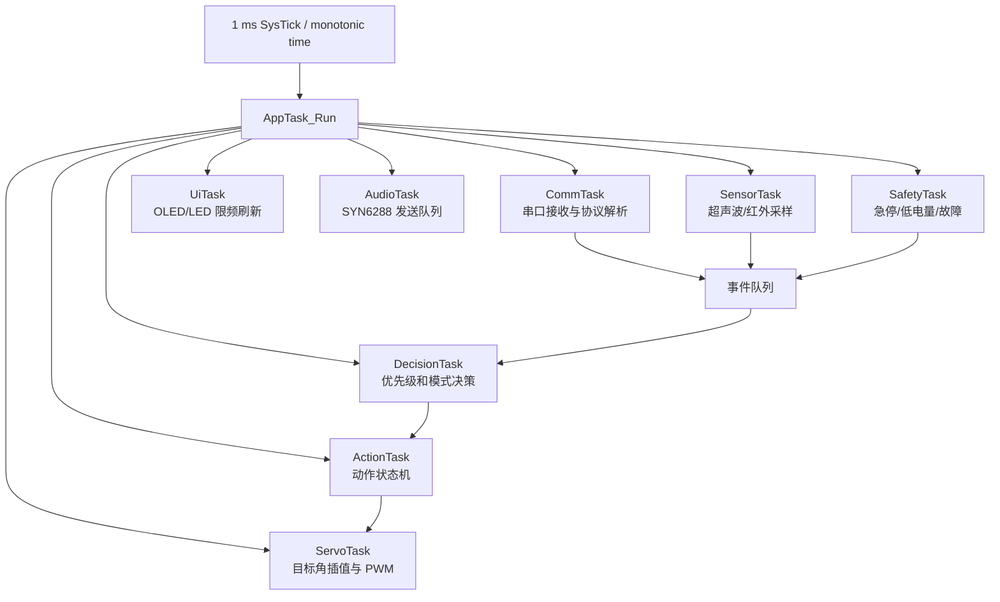

# 曼波机器狗非阻塞状态机重构方案

**文档状态：** 设计方案  
**适用基线：** STM32 主控固件提交 `19d8bf7` 及后续文档版本  
**目标平台：** STM32F103C8T6，裸机 + STM32F10x 标准外设库  
**核心目标：** 在不改变现有控制协议和主要动作表现的前提下，将动作、串口、超声波、红外、OLED 和语音播报从长时间阻塞调用迁移为可抢占、可超时、可观测的协作式非阻塞状态机。

## 1. 背景与目标

当前固件的主循环位于 `User/main.c`，动作实现主要位于 `Hardware/Movement.c` 和 `User/Mode.c`。大量动作通过 `Delay_ms()`、`Delay_s()` 顺序等待完成；超声波测距在 `Hardware/UltrasonicWave.c` 中固定等待，并在避障循环中重复测量；语音播报也通过同步 UART 发送和延时等待完成。这种设计易于编写单个动作，但会让系统在动作期间无法及时读取新命令、处理急停、更新传感器状态或执行故障保护。

本方案不建议一次性重写所有动作，而是采用**分层、增量、可回滚**的迁移方式。第一阶段先建立统一时基、事件队列和急停通道；第二阶段将基础步态改成目标姿态序列；第三阶段再迁移复杂表演动作、超声波避障和语音播报。

| 目标 | 当前问题 | 重构后的期望 |
|---|---|---|
| 控制响应 | 长动作中串口无法及时处理 | 普通命令在一个调度周期内被接收，急停具有最高优先级 |
| 动作执行 | `Delay_ms()` 串联动作步骤 | 每次调用只推进一个小步骤，下一步由时间戳决定 |
| 避障 | 固定等待和无总超时循环 | 传感器采样、决策和动作分离，并且每次操作都有超时 |
| 语音 | 同步发送和长时间等待 | UART 发送队列后台发送，播报可取消或降级 |
| 故障安全 | 传感器或舵机异常时缺少统一出口 | 所有模块都能发布故障事件，安全状态可打断普通动作 |
| 可测试性 | 逻辑与延时、硬件调用紧密耦合 | 状态转换和动作序列可使用模拟时钟、模拟舵机进行测试 |

## 2. 当前实现中的阻塞点

### 2.1 动作函数阻塞

`Hardware/Movement.c` 中的 `move_forward()`、`move_behind()`、`move_left()`、`move_right()` 和趣味动作函数都直接设置多个舵机，然后调用 `Delay_ms()`。例如一个动作可能连续改变四个舵机，再等待数百毫秒，主循环在等待期间不能完成新命令分发。

`User/Mode.c` 又在动作前后增加 OLED 刷新、SYN6288 播报和状态更新，使一次模式调用的总耗时更长。`mode_hello()`、`mode_biaobai()`、`mode_yuansu()` 等动作还包含秒级的语音延时，属于必须迁移的长任务。

### 2.2 超声波测距阻塞

当前 `UltrasonicWave_Getvalue()` 触发传感器后固定等待约 100 ms，再使用 `Time` 计算距离；`Bizhang()` 在距离过近时进入循环，连续执行转向和再次测距。传感器断线、Echo 卡高或机器人被障碍物卡住时，避障循环可能持续很久。

重构后应将测距拆为“触发、等待 Echo、读取结果、超时结束”四个状态，并设置单次测量超时和连续失败上限。

### 2.3 串口接收和发送阻塞

当前 USART 接收使用单字节缓存和 flag。主循环长时间阻塞时，后到的字节可能覆盖前一个字节。USART2 语音发送使用逐字节轮询等待，长文本会占用主循环。

非阻塞版本应使用接收环形缓冲区和发送环形缓冲区。中断只负责搬运字节，协议解析和命令决策在主循环的固定调度阶段完成。

## 3. 总体架构

建议增加一个轻量级的 `AppTask_Run(now_ms)` 调度器，不引入完整 RTOS。STM32F103 的主循环保持单线程协作式执行，每个任务遵守“短、可重复调用、不得主动等待”的约束。



核心原则是：**事件产生者不直接执行长动作，决策层只改变状态，执行层在后续调度周期中逐步完成动作。**这样，收到急停事件时可以立即将动作状态机切换到安全状态，而不用等待当前动作的 `Delay_ms()` 返回。

## 4. 时间基准和调度器

### 4.1 统一时间基准

增加一个单调递增的毫秒计数器。计数器可以由 SysTick 中断递增，也可以使用已有定时器扩展。计数器必须声明为 `volatile`，读取时使用无符号差值判断超时，以正确处理 32 位回绕。

```c
// System/Timebase.h
#ifndef TIMEBASE_H
#define TIMEBASE_H

#include "stm32f10x.h"

void Timebase_Init(void);
uint32_t Timebase_NowMs(void);

#endif
```

```c
// System/Timebase.c：示意实现
static volatile uint32_t g_now_ms;

void SysTick_Handler(void)
{
    g_now_ms++;
}

uint32_t Timebase_NowMs(void)
{
    return g_now_ms;
}

static uint8_t Time_Expired(uint32_t now, uint32_t deadline)
{
    return (int32_t)(now - deadline) >= 0;
}
```

如果当前工程已经使用 SysTick 作为 `Delay_ms()` 的基础，应先确认中断向量和时基实现，避免重复定义 `SysTick_Handler`。迁移期间可以保留旧延时函数，但新模块不得调用它。

### 4.2 协作式任务周期

每个任务都只在到期时运行一次，并且单次执行不包含循环等待。建议初始周期如下：

| 任务 | 周期 | 单次预算 | 说明 |
|---|---:|---:|---|
| 串口接收/解析 | 每轮或 1 ms | < 0.2 ms | 尽快搬运并解析有限数量的字节 |
| 安全任务 | 每轮或 1 ms | < 0.1 ms | 急停、低电量、故障优先 |
| 舵机插值 | 10 ms | < 0.2 ms | 每个舵机向目标角推进一小步 |
| 红外采样 | 10 ms | < 0.1 ms | 读取 GPIO 并更新去抖状态 |
| 超声波任务 | 5–10 ms | < 0.2 ms | 采用状态机，不等待 Echo |
| 动作决策 | 每轮 | < 0.2 ms | 状态转换和动作步骤推进 |
| OLED 刷新 | 50–100 ms | < 2 ms | 仅在内容变化时刷新 |
| 语音发送 | 每轮 | < 0.2 ms | 发送有限字节，不等待整帧结束 |

示意主循环如下：

```c
int main(void)
{
    Board_Init();
    App_Init();

    while (1)
    {
        uint32_t now = Timebase_NowMs();

        CommTask_Run(now);
        SafetyTask_Run(now);
        SensorTask_Run(now);
        DecisionTask_Run(now);
        ActionTask_Run(now);
        ServoTask_Run(now);
        AudioTask_Run(now);
        UiTask_Run(now);
    }
}
```

主循环不应使用固定 `Delay_ms(50)`。如果没有任务到期，循环可以持续运行，也可以在确认中断唤醒机制可靠后进入低功耗等待。第一版重构优先保持简单，不急于加入低功耗。

## 5. 状态模型

### 5.1 顶层状态

建议把“安全状态”“运动状态”“表演状态”和“传感器模式”分开，不再让一个 `move_mode` 字符同时承担所有职责。

```c
typedef enum {
    ROBOT_BOOT = 0,
    ROBOT_SAFE_STOP,
    ROBOT_IDLE,
    ROBOT_STANDING,
    ROBOT_MOVING,
    ROBOT_PERFORMING,
    ROBOT_SLEEPING,
    ROBOT_LOW_POWER,
    ROBOT_FAULT
} RobotState;

typedef enum {
    MOTION_NONE = 0,
    MOTION_FORWARD,
    MOTION_BACKWARD,
    MOTION_TURN_LEFT,
    MOTION_TURN_RIGHT,
    MOTION_STAND,
    MOTION_LIE,
    MOTION_DANCE,
    MOTION_HELLO
} MotionId;
```

`RobotState` 描述当前系统生命周期和安全级别，`MotionId` 描述动作内容，二者不要混为一个枚举。例如机器人可以处于 `ROBOT_MOVING`，当前动作是 `MOTION_FORWARD`，同时超声波模式为开启。

### 5.2 状态转换规则

| 当前状态 | 事件 | 下一状态 | 动作 |
|---|---|---|---|
| 任意普通状态 | `EVT_EMERGENCY_STOP` | `ROBOT_SAFE_STOP` | 立即停止动作并将舵机切到安全姿态 |
| 任意普通状态 | `EVT_LOW_STAMINA` | `ROBOT_LOW_POWER` | 拒绝普通移动，允许休息/睡眠命令 |
| `ROBOT_BOOT` | 初始化完成 | `ROBOT_IDLE` | 设置初始姿态和 UI |
| `ROBOT_IDLE` | 移动命令 | `ROBOT_MOVING` | 启动对应动作实例 |
| `ROBOT_MOVING` | 动作完成 | `ROBOT_IDLE` | 更新体力并释放动作实例 |
| `ROBOT_MOVING` | 新移动命令 | `ROBOT_MOVING` | 替换或排队动作，取决于命令策略 |
| `ROBOT_IDLE` | 表演命令 | `ROBOT_PERFORMING` | 启动可取消的动作脚本 |
| `ROBOT_PERFORMING` | 普通新命令 | `ROBOT_PERFORMING` | 默认忽略或排队 |
| `ROBOT_PERFORMING` | 急停/故障 | `ROBOT_SAFE_STOP`/`ROBOT_FAULT` | 立即抢占 |
| `ROBOT_SLEEPING` | 休息完成 | `ROBOT_IDLE` | 恢复体力并更新表情 |

### 5.3 事件定义和优先级

```c
typedef enum {
    EVT_NONE = 0,
    EVT_EMERGENCY_STOP,
    EVT_SERVO_FAULT,
    EVT_SENSOR_TIMEOUT,
    EVT_LOW_STAMINA,
    EVT_UART_COMMAND,
    EVT_OBSTACLE_NEAR,
    EVT_OBSTACLE_CLEAR,
    EVT_ACTION_STEP,
    EVT_ACTION_DONE,
    EVT_AUDIO_DONE
} EventType;

typedef struct {
    EventType type;
    uint8_t source;
    uint8_t command;
    uint16_t value;
    uint32_t timestamp;
} AppEvent;
```

建议使用固定长度环形队列，不使用动态内存。事件优先级从高到低为：安全故障、急停、低电量、传感器避障、移动命令、表演命令、UI 和语音播报完成事件。队列满时，普通表演事件可以丢弃，但急停和故障事件必须有独立的高优先级标志位，不能依赖普通队列成功入队。

## 6. 动作状态机设计

### 6.1 从“整段函数”迁移到“动作实例”

现有 `move_forward()` 等函数不应直接在主循环中调用。建议把动作拆成由若干个姿态步骤组成的脚本，每个步骤包含目标舵机角度、持续时间和过渡方式。

```c
typedef struct {
    uint8_t angle[4];
    uint16_t duration_ms;
    uint8_t interpolation;
} PoseStep;

typedef struct {
    const PoseStep *steps;
    uint8_t step_count;
    uint8_t current_step;
    uint32_t step_deadline;
    MotionId motion;
    uint8_t cancellable;
    uint8_t active;
} ActionInstance;
```

动作任务每次运行时只做以下工作：检查当前步骤是否到期；如果未到期，更新舵机目标角并立即返回；如果到期，切换到下一步骤；所有步骤完成后发布 `EVT_ACTION_DONE`。

```c
void ActionTask_Run(uint32_t now)
{
    if (!g_action.active) {
        return;
    }

    if (Action_CancelRequested()) {
        Action_AbortToSafeStop();
        return;
    }

    if (!Time_Expired(now, g_action.step_deadline)) {
        return;
    }

    if (g_action.current_step >= g_action.step_count) {
        g_action.active = 0;
        Event_Post(EVT_ACTION_DONE, 0);
        return;
    }

    const PoseStep *step = &g_action.steps[g_action.current_step++];
    Servo_SetTargets(step->angle);
    g_action.step_deadline = now + step->duration_ms;
}
```

### 6.2 舵机任务

动作状态机只设置目标角，不直接承担平滑插值。`ServoTask_Run()` 每 10 ms 读取当前角度和目标角，对每个舵机向目标角移动一个最大步长，然后写入 PWM。

```c
void ServoTask_Run(uint32_t now)
{
    if (!Periodic_Due(now, &g_servo_next, 10)) {
        return;
    }

    for (uint8_t i = 0; i < SERVO_COUNT; ++i) {
        int16_t error = (int16_t)g_servo_target[i]
                      - (int16_t)g_servo_current[i];
        int16_t step = Clamp(error, -SERVO_STEP_DEG, SERVO_STEP_DEG);
        g_servo_current[i] += step;
        Servo_Write(i, g_servo_current[i]);
    }
}
```

这样可以统一处理站立、行走和表演动作的速度，并且在急停时把目标姿态改为安全目标，不需要搜索和打断多个嵌套延时。

### 6.3 动作命令策略

移动命令和表演命令应采用不同策略。移动命令通常只保留最新命令，例如前进过程中收到左转，应立即替换目标动作；表演命令可以只允许一个活动实例，收到新的表演命令时返回忙碌状态；急停和故障则无条件抢占。

| 命令类别 | 队列策略 | 是否可抢占 |
|---|---|---|
| 急停/故障 | 独立高优先级标志 | 可以抢占所有状态 |
| 前进/后退/转向 | 只保留最新一条 | 可以替换当前移动动作 |
| 站立/趴下 | 立即设置姿态目标 | 可以中断移动 |
| 跳舞/打招呼 | 单实例 | 仅被急停、故障、低电量打断 |
| OLED/语音提示 | 可丢弃或合并 | 不应阻塞动作 |

## 7. 非阻塞超声波避障

### 7.1 测距状态

建议将单次测距拆成以下状态：

```c
typedef enum {
    US_IDLE = 0,
    US_TRIGGER_HIGH,
    US_WAIT_ECHO_RISE,
    US_WAIT_ECHO_FALL,
    US_RESULT_READY,
    US_TIMEOUT
} UltrasonicState;
```

状态转移如下：

```text
US_IDLE
  └─ 到采样时间 ─> US_TRIGGER_HIGH
                    └─ 触发脉冲完成 ─> US_WAIT_ECHO_RISE
                                          ├─ Echo 上升 ─> US_WAIT_ECHO_FALL
                                          │                 ├─ Echo 下降 ─> US_RESULT_READY
                                          │                 └─ 超时 ─────> US_TIMEOUT
                                          └─ 等待超时 ──> US_TIMEOUT
```

每次 `UltrasonicTask_Run()` 只读取 GPIO、记录时间或切换一次状态，绝不调用 `Delay_ms(100)`。建议参数如下：

| 参数 | 初始值 | 说明 |
|---|---:|---|
| 触发脉冲 | 10–15 µs | 可由微秒级硬件定时器或短临界区完成 |
| 最小采样间隔 | 60 ms | 避免连续触发造成回波干扰 |
| 等待 Echo 上升超时 | 30 ms | 无目标或传感器断线时结束 |
| Echo 高电平最大宽度 | 25 ms | 覆盖目标测距范围并防止卡高 |
| 连续失败次数 | 3 | 超过后发布传感器故障事件 |
| 连续近距离次数 | 2–3 | 再进入转向避障动作，减少偶发误触发 |

### 7.2 避障决策和动作分离

测距任务只产生 `distance_cm`、`valid` 和 `timestamp`，不直接调用 `move_right()`。决策任务根据最新有效距离和红外状态发布 `EVT_OBSTACLE_NEAR` 或 `EVT_OBSTACLE_CLEAR`；动作任务再启动短时转向脚本。

当避障动作连续失败达到上限时，应进入 `ROBOT_SAFE_STOP` 或 `ROBOT_FAULT`，而不是无限执行转向。急停命令在任何避障状态下都应优先处理。

## 8. 串口和语音非阻塞化

### 8.1 接收环形缓冲区

USART 中断只做三件事：读取数据寄存器、写入环形缓冲区、记录溢出标志。主循环中的 `CommTask_Run()` 再逐字节取出并转换为 `AppEvent`。

```c
#define UART_RX_CAPACITY 16U

typedef struct {
    volatile uint8_t data[UART_RX_CAPACITY];
    volatile uint8_t head;
    volatile uint8_t tail;
    volatile uint8_t overflow;
} ByteRing;

void USART3_IRQHandler(void)
{
    if (USART_GetITStatus(USART3, USART_IT_RXNE) == SET) {
        uint8_t byte = (uint8_t)USART_ReceiveData(USART3);
        Ring_PushFromIsr(&g_uart3_rx, byte);
    }
}
```

蓝牙和 ESP32 当前使用单字符协议，因此解析器可以保持简单。不要继续使用“分别读取 flag 和 data”的接口，因为这会产生竞态；推荐提供 `UART_ReadByte()` 或 `UART_ReadCommand()` 的原子接口。

### 8.2 语音发送队列

SYN6288 发送应拆为“帧构造”和“UART 发送”两部分。`AudioTask_Run()` 每次只发送一个或有限数量的字节，发送寄存器空闲后由 TXE 中断继续发送。语音播报请求写入固定长度的音频队列；新请求到来时可以合并、丢弃或取消旧提示。

建议定义如下接口：

```c
bool Audio_EnqueueText(const char *text, uint8_t priority);
void Audio_CancelLowPriority(void);
void AudioTask_Run(uint32_t now);
uint8_t Audio_IsBusy(void);
```

低优先级状态播报不能阻塞急停、动作和传感器任务。欢迎语音、状态播报和错误播报应使用不同优先级。

## 9. UI 和状态管理

OLED 刷新也应从动作函数中移出。动作只发布“表情改变”或“状态值改变”事件，`UiTask_Run()` 按 50–100 ms 的最低刷新间隔处理脏标记。相同图片和相同文本不重复刷新。

建议将状态集中到一个结构体中：

```c
typedef struct {
    RobotState robot_state;
    MotionId motion;
    uint16_t stamina;
    uint16_t happiness;
    uint8_t ultrasonic_enabled;
    uint8_t infrared_enabled;
    uint8_t fault_flags;
    uint32_t last_command_ms;
} RobotContext;
```

任何模块不应直接修改另一个模块的全局状态。体力和开心值由 `StateTask` 或 `RobotContext` 的接口统一更新，并在边界处饱和到合法范围。

## 10. 模块和文件迁移建议

建议新增以下文件，而不是继续扩展 `User/main.c`：

| 文件 | 职责 |
|---|---|
| `Application/AppTask.c/h` | 主循环任务调度和初始化 |
| `Application/AppEvent.c/h` | 固定长度事件队列和事件类型 |
| `Application/RobotState.c/h` | 顶层状态、优先级和安全转换 |
| `Application/ActionTask.c/h` | 动作脚本、动作实例和取消逻辑 |
| `Application/ServoTask.c/h` | 舵机目标、插值和 PWM 输出调度 |
| `Application/SensorTask.c/h` | 红外、超声波采样和异常状态 |
| `Application/CommTask.c/h` | USART 环形缓冲区和单字符解析 |
| `Application/AudioTask.c/h` | SYN6288 帧队列和非阻塞发送 |
| `Application/UiTask.c/h` | OLED 脏标记、表情和 LED 心跳 |
| `System/Timebase.c/h` | 单调毫秒时基 |

迁移期间，旧的 `Mode.c` 可以保留作为兼容层。兼容层将旧命令转换为新的 `MotionId`，但不能在新调度器中继续调用包含 `Delay_ms()` 的旧动作函数。

## 11. 分阶段实施计划

### 阶段一：建立基础设施

新增 `Timebase`、事件类型、环形缓冲区和任务调度框架。先不改变动作表现，只让 USART1/USART3 接收改为环形缓冲区，并增加独立急停标志。验收标准是连续发送 16 个命令不会静默覆盖，急停能在一个调度周期内触发。

### 阶段二：迁移基础姿态

先迁移 `move_stand()`、`move_slow_stand()`、前进、后退、左转和右转。每个动作先整理为少量 `PoseStep`，由 `ServoTask` 插值执行。旧函数与新动作不能同时控制相同 PWM 通道。

验收标准是站立和基础移动的最终姿态与旧版一致，舵机没有突然跳变；在动作执行期间发送停止、转向和新移动命令能够按预期生效。

### 阶段三：迁移复杂动作和状态值

将握手、打招呼、跳舞、伸懒腰和睡眠动作转换为动作脚本。把 OLED、LED、体力和开心值更新从动作函数分离出来，由事件或状态转换触发。

验收标准是复杂动作可取消、动作结束后状态值只更新一次，语音或 OLED 异常不会阻塞舵机状态机。

### 阶段四：迁移超声波和红外

实现超声波测距状态机、测距超时、连续失败计数和避障动作决策。红外输入增加去抖和采样周期，不在 GPIO 检测函数中直接执行长动作。

验收标准是无 Echo、持续近距离和桌面边缘三种场景下系统不会进入无限等待，并且急停、低电量和串口命令仍然可用。

### 阶段五：迁移语音播报和清理旧接口

将 SYN6288 发送改为队列 + TXE 中断，完成后删除或隔离旧的同步发送路径。确认 `Hardware/Serial.c` 与 `System/usart*.c` 的职责，最终只保留一套实际使用的 USART 抽象。

验收标准是长语音播报期间机器人仍能读取急停和故障事件；所有新模块不再调用 `Delay_ms()`、`Delay_s()` 或无界 `while`。

## 12. 测试与验收

### 12.1 单元级测试

动作脚本应使用模拟时间验证：步骤在截止时间前不会提前切换，截止时间到达后只切换一步；取消动作后不会继续写入旧目标角；队列满时普通事件可以按策略丢弃，而急停始终保留。

环形缓冲区需要覆盖空队列、满队列、头尾回绕、中断写入与主循环读取交错等情况。超声波状态机需要覆盖正常回波、无回波、Echo 卡高、重复近距离和计时器回绕。

### 12.2 台架测试

台架测试应先断开腿部机械负载，检查四路 PWM 目标变化、急停、串口连续命令和 OLED 更新。然后单腿低速测试，再逐步加载全部舵机。所有测试都应记录 MCU 复位、舵机抖动、命令延迟和电源电压。

### 12.3 建议量化指标

| 指标 | 目标值 |
|---|---:|
| 普通命令从接收至状态转换 | ≤ 10 ms |
| 急停从接收至停止目标下发 | ≤ 5 ms |
| 主循环单轮最大执行时间 | ≤ 2 ms |
| 超声波单次测量最大阻塞时间 | 0 ms；以状态机等待 |
| 单次动作步骤推进 | ≤ 10 ms 调度周期 |
| UART 接收溢出 | 正常操作下为 0 |
| 传感器无回波后的故障判定 | ≤ 100 ms |
| OLED 刷新频率 | 10–20 Hz 上限 |

## 13. 风险与回滚策略

非阻塞重构最大的风险是动作时序变化、舵机目标更新过快、电源负载变化和状态优先级错误。每迁移一个动作，应保留旧版动作作为对照，并通过编译宏或独立分支切换新旧实现。不要在一次提交中同时修改动作参数、舵机方向、供电配置和通信协议。

建议按以下原则回滚：若新动作出现姿态不稳定，回滚该动作脚本而不是整个调度器；若通信异常，保留新事件层但暂时恢复旧解析器；若超声波异常，关闭自动避障并进入安全停止，而不是继续执行未知动作。

## 14. 与当前仓库的对应关系

| 当前文件 | 重构后的处理 |
|---|---|
| `User/main.c` | 缩减为板级初始化和 `AppTask_Run()` 主循环 |
| `User/Mode.c` | 逐步迁移为状态转换、动作请求和状态值接口 |
| `Hardware/Movement.c` | 将阻塞式动作拆成 `PoseStep` 动作脚本 |
| `Hardware/Servo.c` | 保留角度到 PWM 的边界保护，增加目标角接口 |
| `Hardware/UltrasonicWave.c` | 改为测距状态机，不再固定 `Delay_ms(100)` |
| `System/usart1.c`、`usart3.c` | 改为中断环形缓冲区和事件解析 |
| `System/usart2.c`、`Hardware/syn6288.c` | 改为语音帧队列和非阻塞发送 |
| `Hardware/OLED.c` | 保留底层驱动，刷新请求移交 `UiTask` |
| `Hardware/Timer.c` | 明确作为超声波捕获或系统时基的一部分，避免重复初始化 |

## 15. 结论

这次重构不应被理解为简单地把 `Delay_ms()` 替换成 `if`。真正的目标是建立“事件输入—优先级决策—动作实例—舵机执行—传感器反馈”的闭环。动作脚本负责描述做什么，舵机任务负责如何平滑执行，安全任务负责何时可以打断，通信和传感器任务负责提供可超时的输入。

按照本方案分阶段实施后，曼波机器狗可以在保持现有单字符协议和主要动作的同时，获得更好的急停响应、连续命令处理、传感器故障恢复和后续扩展能力。第一版建议只迁移基础站立和移动动作，确认调度器稳定后再迁移复杂表演动作和语音播报。

## 参考实现文件

[1]: `User/main.c`，当前初始化、主循环和命令分发。  
[2]: `Hardware/Movement.c`，当前阻塞式舵机动作序列。  
[3]: `User/Mode.c`，当前行为模式、体力/开心值和播报逻辑。  
[4]: `Hardware/UltrasonicWave.c`，当前超声波触发、固定等待和避障循环。  
[5]: `System/usart1.c`、`System/usart2.c`、`System/usart3.c`，当前串口驱动。  
[6]: `Hardware/syn6288.c`，当前 SYN6288 语音帧构造与发送。  
[7]: [`docs/software.md`](software.md)，现有软件架构、主程序流程和扩展说明。  
[8]: [`ASRPro_Code/docs/protocol.md`](../ASRPro_Code/docs/protocol.md)，ESP32 与 STM32 的单字符通信协议。
