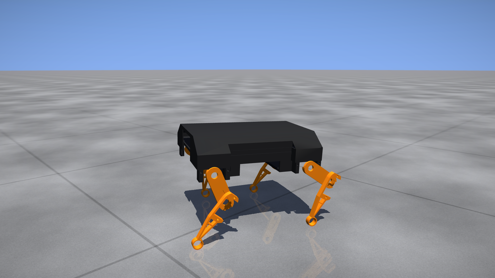
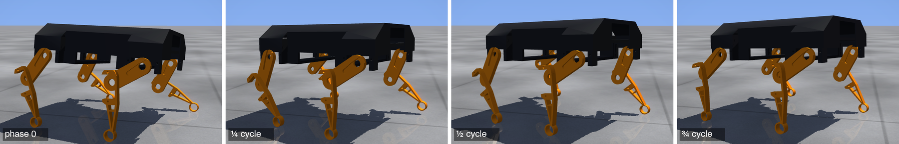
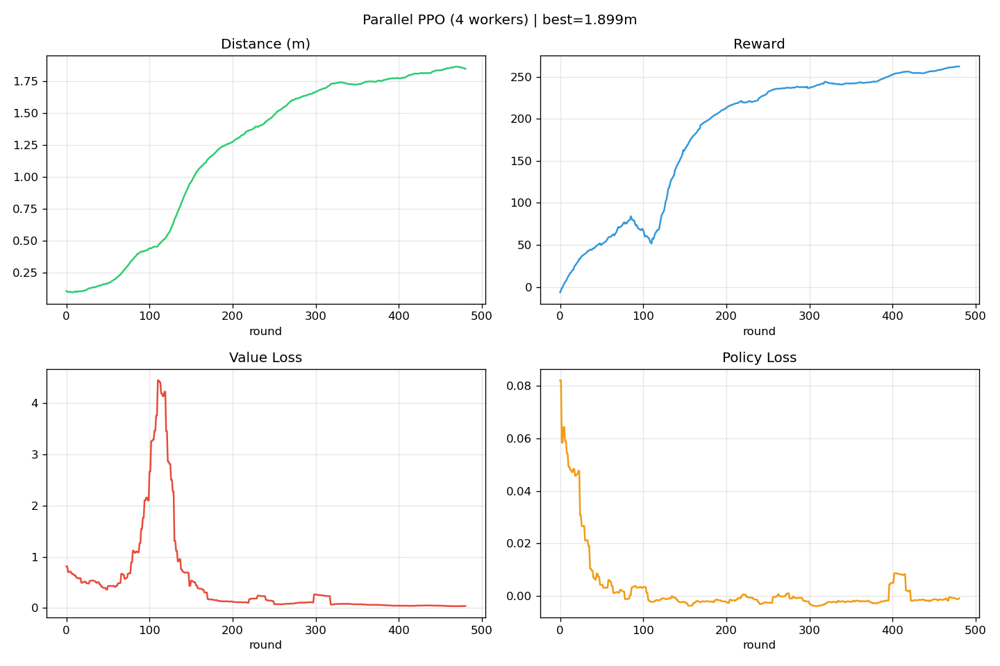
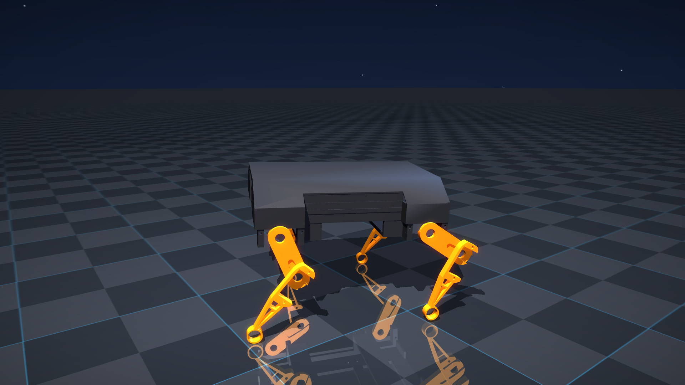

<div align="center">

# AlbertPro

**A 14 cm quadruped that learns to walk in MuJoCo — and walks on an ESP32.**

[](LICENSE)




</div>

Albert is a small 4-legged robot (14 × 11 × 2 cm body, 8 servos). This repo holds the
whole sim2real loop: a PPO policy trained in MuJoCo, exported as a plain C header, and
run on an ESP32 that drives the servos over I²C.

```
MuJoCo + PPO  ──►  policy.h / trajectory.h  ──►  ESP32 + PCA9685  ──►  8 servos
   (RL/)              (auto-generated)              (ESP32/)
```

## It walks

<div align="center">

</div>

The learned gait, one full cycle — the policy runs at 100 Hz and the body advances at
~0.25 m/s:



## It learns

Same camera, same 8-second episode, four checkpoints from the same training run —
round 49 flails, round 249 shuffles forward, by round 849 it is trotting:

<div align="center">

</div>

| | | |
|---|---|---|
| round 49 | round 249 | round 849 → 2499 |
| +0.01 m | +0.18 m | +0.53 m per 8 s episode |

<div align="center">

</div>

Full-resolution 1080p60 renders live in [`RL/movies/`](RL/movies):
[`albert_day.mp4`](RL/movies/albert_day.mp4) ·
[`albert_night.mp4`](RL/movies/albert_night.mp4) ·
[`albert_learning.mp4`](RL/movies/albert_learning.mp4)

<div align="center">

</div>

## Robot

| | |
|---|---|
| Body | 14 × 11 × 2 cm, ~0.13 m standing height |
| Legs | 4 × (hip + knee) = 8 DOF, 5 cm upper / 5 cm lower |
| Actuators | 8 servos via PCA9685 (I²C), position control |
| Brain | ESP32, Bluetooth serial for commands |
| Neutral pose | hip 0.90 rad, knee −1.40 rad |

## `RL/` — training in MuJoCo

PPO + GAE on a **ΔΔθ** action space: the network outputs *changes to a persistent delta
buffer*, i.e. acceleration-level joint control, which makes the resulting gait smooth by
construction instead of by reward shaping.

```
State  (24): joint pos (8) + joint vel (8) + delta (8)
Action  (8): ΔΔθ  →  delta  →  joint targets
Policy:      24 → ReLU(64) → tanh(8)      2120 floats, 8.3 KB
Control:     100 Hz (10 ms), 5 physics substeps at 2 ms
```

| Notebook | What it does |
|---|---|
| [`AllLegs_parallel.ipynb`](RL/AllLegs_parallel.ipynb) | 4 MuJoCo worker processes (~4× faster) + the cinematic renderer |
| [`AllLegs_def.ipynb`](RL/AllLegs_def.ipynb) | reference implementation — sequential PPO |
| [`AllLegs_curriculum.ipynb`](RL/AllLegs_curriculum.ipynb) | curriculum variant |

Reward: forward-velocity tracking (target 0.25 m/s) + alive bonus + yaw penalty,
with regularisation on actions, delta magnitude, joint velocity and joint-limit excursion.

```bash
cd RL
conda env create -f environment.yml
conda activate albert-rl
jupyter notebook AllLegs_parallel.ipynb
```

Training writes checkpoints to `models/`, curves to `plots/`, videos to `movies/`
(all but the best model and the showcase renders are gitignored — they are big).

### Cinematic renderer

Any checkpoint can be re-rendered as finished footage:

```python
render_cinematic('movies/albert_day.mp4',   weights=best_w, look='day')
render_cinematic('movies/albert_night.mp4', weights=best_w, look='night')
render_cinematic('movies/slowmo.mp4',       weights=best_w, slowmo=0.4)
render_progress_montage('movies/albert_learning.mp4', look='day', n_clips=8)
```

It generates `dog_cinematic_<look>.xml` from `dog.xml` — **visuals only**, bodies /
joints / actuators are byte-identical, so the physics you film is the physics you trained.
On top: a 4-shot camera choreography with a damped follow cam, motion blur from
control-rate→fps resampling, and a bloom + vignette grade. Two looks — `day` (blue sky,
procedural concrete slabs) and `night` (dark studio, glossy cyan grid).

## `ESP32/` — running it on the robot

The trained policy is exported two ways:

- **`policy.h`** — the network weights as C arrays plus a self-contained
  `policy_step(state, ctrl, delta)`, for running the policy on-device at 100 Hz.
- **`trajectory.h`** — one gait cycle baked to a fixed-point table
  (`angle_rad = OFFSET[j] + traj[step][j] / 10000.0`), for open-loop playback.

| Sketch | What it does |
|---|---|
| [`Albert_AML_traj/`](ESP32/Albert_AML_traj) | plays back one exported gait cycle |
| [`Albert_AML_meta/`](ESP32/Albert_AML_meta) | four gaits (forward / back / left / right), switched over Bluetooth |

Both use `Adafruit_PWMServoDriver` (PCA9685) and `BluetoothSerial`. Send a single
character over BT or USB serial: `f` forward, `b` back, `l` left, `r` right, `s` stop.

Joint angles map to servo pulses as
`pulse = CENTER + angle_rad * PULSE_PER_RAD * DIR[ch]`, with per-channel direction
signs so left and right legs mirror correctly.

### Flashing

1. Arduino IDE → board **ESP32 Dev Module**.
2. Install libraries: `Adafruit PWM Servo Driver Library`, `Adafruit BusIO`.
3. Copy the freshly exported header into the sketch folder
   (`RL/export/trajectory.h` → `ESP32/Albert_AML_traj/trajectory.h`).
4. Upload, power the servo rail separately from the ESP32, pair over Bluetooth.

## Layout

```
RL/
  AllLegs_parallel.ipynb   parallel PPO + cinematic renderer
  AllLegs_def.ipynb        reference sequential PPO
  AllLegs_curriculum.ipynb curriculum variant
  _parallel_worker.py      subprocess rollout worker
  dog.xml                  MuJoCo model (physics + visuals)
  dog_cinematic_*.xml      generated: same physics, film visuals
  meshes/                  trunk / upper_leg / lower_leg STL
  models/                  best policy (.pth) + policy.h
  trajectories/            exported gait: .npy / .csv / .h
  movies/  plots/          showcase renders and training curves
ESP32/
  Albert_AML_traj/         single-gait playback sketch
  Albert_AML_meta/         four-gait sketch, Bluetooth switching
  trajectory.h             latest exported gait
docs/                      images used by this README
```

## License

[MIT](LICENSE) — free to use, modify and redistribute, including commercially,
as long as the copyright notice and licence text travel with it.
