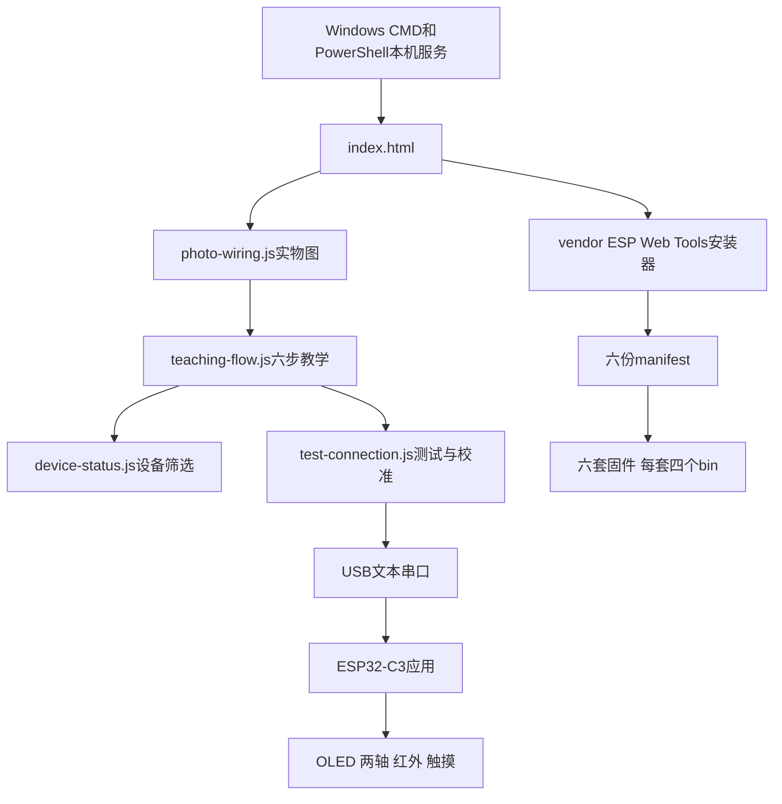

# 小纸壳机器人配套生态与代码导读

本项目的配套是“复刻指南—网页教学工具—六套烧录固件—纸板模板与双轴机构”。这些资料不在同一个完整源码仓里；按你提供的ZIP可以读到网页实现，但还不能修改并重新构建作者的完整嵌入式程序。

## 当前工具实际执行链

默认 `index.html` 与 `index-photo.html`内容相同；`photo-wiring.js`导入`teaching-flow.js`。简化入口`index-simple.html`直接导入后者。包内另有`teaching-page.js`，但这三个入口都没有导入它。后续改界面先定位实际入口，避免改了未使用文件却误以为已生效。

## 代码入口及借鉴点

| 文件 | 已读内容 | 自研借鉴 |
|---|---|---|
| [teaching-flow.js](<%E5%B7%A5%E5%85%B7%E5%8C%85/cardboard-bot-teaching/teaching-flow.js>) | 六步模块、GPIO、四阶段流程、校准控件、页面离开处理 | 同一接线表生成图和验收步骤，避免手工维护多个不一致版本 |
| [photo-wiring.js](<%E5%B7%A5%E5%85%B7%E5%8C%85/cardboard-bot-teaching/photo-wiring.js>) | 五类实物接线图、完整系统四图汇总、图片放大 | 器件针脚和实物图并列，学生可逐项核对 |
| [device-status.js](<%E5%B7%A5%E5%85%B7%E5%8C%85/cardboard-bot-teaching/device-status.js>) | 303A:1001筛选、授权端口、连接状态事件 | 候选设备筛选与固件身份识别分两层 |
| [test-connection.js](<%E5%B7%A5%E5%85%B7%E5%8C%85/cardboard-bot-teaching/test-connection.js>) | 换行协议、顺序写队列、握手、保活、状态解析和校准 | 单一串口控制器、显式状态与按钮条件；身份误判和断开行为须改进 |
| [release.json](<%E5%B7%A5%E5%85%B7%E5%8C%85/cardboard-bot-teaching/release.json>)与manifest | 六应用、地址、文件大小和SHA256 | 固件、页面和硬件配置应使用明确的版本契约 |
| [Windows启动脚本](<%E5%B7%A5%E5%85%B7%E5%8C%85/cardboard-bot-teaching/start-offline-installer.ps1>) | 回环地址服务、39876至39926端口、目录边界与资源读取 | 浏览器安装工具可离线使用；跨平台启动器需另做验证 |
| [vendored依赖说明](<%E5%B7%A5%E5%85%B7%E5%8C%85/cardboard-bot-teaching/vendor/esp-web-tools/README.md>) | 声称基于ESP Web Tools10.1.0，修改筛选、复位、日志与重试 | 修改过的依赖应记录补丁，升级不能只替换一两个压缩文件 |

本次仅在隔离模拟环境执行TestConnection部分方法，用假串口验证逻辑；没有启动作者的Windows脚本、安装器或固件。

## 作者其他项目可以参考什么

以下来自提供指南的作者项目章节，远程帖子在本次直接读取时不可访问，因此只按指南证据引用，不能声称重新验证或已取得其源码。全部原链接保存在[指南外链索引](<%E5%8E%9F%E5%A7%8B%E8%B5%84%E6%96%99/%E6%8C%87%E5%8D%97%E5%A4%96%E9%83%A8%E9%93%BE%E6%8E%A5%E7%B4%A2%E5%BC%95.json>)。

| 作者项目 | 指南记载 | 与纸壳第一版的关系 | 还缺什么 |
|---|---|---|---|
| [迷你游戏机](https://www.rednote.com/discovery/item/6a75a30f00000000220150ea) | ESP32-S3-WROOM-1 N16R8、2寸ST7789 240×320、摇杆、A/B键、无源蜂鸣器；PlatformIO/Arduino_GFX | 可参考按键输入、屏幕资源和网页刷机课程 | 完整GPIO、源码工程与可重复构建条件 |
| [桌面智能体材料](https://www.rednote.com/discovery/item/6a633ed3000000000301ffa0)及[后端迭代](https://www.rednote.com/discovery/item/6a7045b40000000032023ae0) | 指南辨认ESP32-S3-CAM、MAX98357A，架构图提INMP441、Wi-Fi/WebSocket与Agent；作者自述后续接入Hermes | 提供“设备表达＋电脑或服务器推理”的扩展思路；不是C3纸壳的即插即用配件 | 音频GPIO、显示型号、后端仓、协议与实际部署步骤 |
| [智能番茄钟](https://www.rednote.com/discovery/item/6a5de9050000000011017a97) | 作者搭建叙述与开发板、屏幕、按钮实拍 | 可迁移时间管理和状态表达的课程想法 | 板型、完整BOM、接线与程序 |
| [3D交互电路模拟](https://www.rednote.com/discovery/item/6a5f59e8000000000f0295fd)与[AI硬件工作台](https://www.rednote.com/discovery/item/6a60d858000000000f017234) | 辅助设计工具，后者当时仍开发中 | 可参考接线可视化、学习引导与模块说明 | 产品入口、代码、依赖，两个工具是否同一工程 |
| [纸壳3D说明书帖子](https://www.rednote.com/discovery/item/6aba2d08000000000a01e290) | 指南含结构透视与模块说明截图 | 用于理解舵机、隔板和检修位置 | 可离线模型、交互说明书实际入口、编辑文件 |

作者介绍的Open Duck Mini、Microduck、SO-101等是其他团队作品线索，不统一归为其原创。纸壳与作者桌面智能体也是两个硬件方案，不把后者材料混入前者采购表。

## 与现有参考库怎样衔接

| 后续方向 | 可读资料 | 对纸壳方案的判断 |
|---|---|---|
| 电脑语音与动作 | [芝麻配套导读](<../01_%E8%8A%9D%E9%BA%BB%E6%9C%BA%E5%99%A8%E4%BA%BA/%E9%85%8D%E5%A5%97%E7%94%9F%E6%80%81%E4%B8%8E%E4%BB%A3%E7%A0%81%E5%AF%BC%E8%AF%BB.md>) | 借鉴ASR、推理、TTS与动作分层；芝麻HTTP接口不能直接控制本包USB命令 |
| 双轴表情与人格 | [Stack-chan导读](<../04_Stack-chan%E6%A1%8C%E9%9D%A2%E6%9C%BA%E5%99%A8%E4%BA%BA/%E9%85%8D%E5%A5%97%E7%94%9F%E6%80%81%E4%B8%8E%E4%BB%A3%E7%A0%81%E5%AF%BC%E8%AF%BB.md>) | 参考注视、倾听和说话的节奏，屏幕驱动和板卡需重新适配 |
| 独立语音设备 | [小智导读](<../08_%E5%B0%8F%E6%99%BA%E8%AF%AD%E9%9F%B3%E6%9C%BA%E5%99%A8%E4%BA%BA/%E9%85%8D%E5%A5%97%E7%94%9F%E6%80%81%E4%B8%8E%E4%BB%A3%E7%A0%81%E5%AF%BC%E8%AF%BB.md>) | 优先另选适合音频的板卡；不能直接把小智固件刷进本C3接线后保留纸壳行为 |
| 个性外壳与模块接口 | [VerdureLab资料](<../12_VerdureLab%E5%A4%96%E5%A3%B3%E8%B5%84%E6%BA%90/README.md>) | 参考可替换造型和固定接口，纸板版本须处理厚度、刚度与线束 |
| 对话与运动双板分工 | [跨项目开发借鉴](<../%E8%B7%A8%E9%A1%B9%E7%9B%AE%E5%BC%80%E5%8F%91%E5%80%9F%E9%89%B4.md>) | 工程建议：语音板或电脑发送有限动作，C3保留运动控制；协议和固件需自研 |

## 配套缺口按影响排序

开工前优先确认原始模板与尺寸单位、实际板型和供电能力、Mac或可用Windows刷写路径。准备改代码时再索取完整C/C++工程、PlatformIO配置或构建环境、OLED表情资源与配置说明。准备产品和教学资料时需要明确作者自有代码、固件、模板与图片的许可。

本次针对Made by Z、cardboard-bot teaching及纸壳3D说明书做公开检索，没有定位到能确认作者归属的完整GitHub工程；这不等于该工程不存在或作者未提供群内下载。已有的三处作者帖子也无法经网页工具直接读取，记录为“待获得可访问入口”，没有用同名仓库替代。
