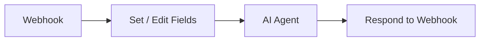

# n8n webhook setup for Yova

This guide shows the quickest way to make Yova work with n8n using a streaming webhook flow.
It describes the n8n setup used by the example connector bundled with Yova (`yova-api-n8n`), but you can implement your own connector as long as it sends compatible payloads and handles streamed responses.
It focuses on:

- what to put in `yova.config.json`
- which n8n nodes to use
- how to configure node options for low-latency streaming
- how to connect nodes correctly

Official n8n docs: [https://docs.n8n.io/](https://docs.n8n.io/)

## 1) Configure Yova (`yova.config.json`)

Set the `n8n` section first:

```json
{
  "n8n": {
    "webhook_url": "https://<your-n8n-host>/webhook/<webhook-id>",
    "auth_header_name": "Authorization",
    "auth_header_value": "<same value as n8n Header Auth>",
    "timeout_seconds": 120,
    "stream": true,
    "session_switch_threshold_seconds": 30,
    "include_hmmm_chunk": true,
    "thinking_delay_seconds": 2.0,
    "extra_payload": {}
  }
}
```

Important:

- `webhook_url` must be the **production** webhook URL from n8n (workflow is Active).
- `auth_header_name` and `auth_header_value` must exactly match the Webhook Header Auth credential in n8n (if enabled).
- `stream` should stay `true` to let Yova consume streamed chunks.

## 2) Build the n8n workflow

Use this minimal node set:

1. `Webhook`
2. `Set` (rename it to `Edit Fields`)
3. `AI Agent`
4. `Respond to Webhook`

## 3) Node diagram (n8n)



## 4) Configure each node

### `Webhook`

- **HTTP Method**: `POST`
- **Authentication**: `Header Auth` (recommended)
- **Response Mode**: `Streaming`
- **Webhook path**: any unique path/id

If you use `Respond to Webhook`, ensure webhook response behavior is set to use that node (not "last node finishes").

### `Set` (`Edit Fields`)

Yova sends data in `body`, so map fields to root:

- `sessionId` = `{{ $json.body.sessionId }}`
- `chatInput` = `{{ $json.body.chatInput }}`

Enable **Include Other Fields** if you want headers/query kept for debugging.

### `AI Agent`

- Enable **streaming** in node options.
- Configure the LLM in the node according to your n8n setup.

### `Respond to Webhook`

- **Respond With**: all incoming items
- **Enable Streaming**: `true`

This keeps the HTTP connection open and pushes chunks as they are generated.

## 5) Connection you must have

Main chain:

- `Webhook` -> `Set (Edit Fields)` -> `AI Agent` -> `Respond to Webhook`

## 6) Streaming settings that reduce delays

For best responsiveness, enable streaming in all three places:

1. `Webhook` response mode = streaming
2. `AI Agent` streaming enabled
3. `Respond to Webhook` streaming enabled

Also check infrastructure:

- Reverse proxy/CDN must not buffer streaming responses.
- Keep request timeout high enough (`n8n.timeout_seconds` in Yova).
- Use a stable network path between Yova host and n8n.

### How webhook streaming works in n8n (short version)

With streaming enabled, n8n does not wait for the full AI response before replying.  
Instead, it keeps the webhook HTTP connection open and sends partial output chunks as they are produced by the `AI Agent`.  
`Respond to Webhook` forwards those chunks immediately, and closes the response when generation is complete.  
Yova reads these chunks progressively, so TTS can start speaking earlier and perceived latency is lower.

## 7) Expected request body from Yova

Yova sends:

```json
{
  "chatInput": "hello",
  "sessionId": "user-or-anonymous"
}
```

`extra_payload` values from Yova config are merged into the same body.

## 8) Quick test

After activating the workflow:

1. Copy the production webhook URL.
2. Put it into `n8n.webhook_url` in `yova.config.json`.
3. Restart `yova-api-n8n`.
4. Send speech input to Yova and confirm chunks are returned progressively.

## Common problems

- `403 authorization` -> header name/value mismatch between Yova and n8n Header Auth.
- `No streaming` -> one of the three streaming toggles is off (Webhook, AI Agent, Respond).
- `Agent gets empty input` -> missing `Set` mapping from `body.chatInput` and `body.sessionId`.

## Related docs

- [config.md](config.md)
- [api_connector_example.md](api_connector_example.md)
