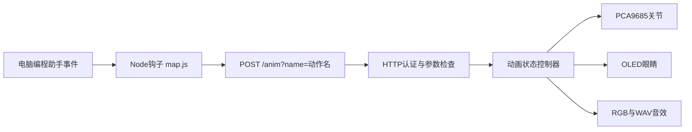

# 配套生态与代码导读

以下按照实际调用链阅读；“建议”表示我们尚未实现的整合。来源均为本目录固定提交快照，线上主分支以后可能变化。

## 主机事件如何变成动作

Claude Code的[map.js](<仓库/jamro__tiny-engineer/packages/tiny-engineer-claude-code/src/map.js>)把 `Read/Grep/Glob/WebFetch/WebSearch` 映射为reading，把 `Bash/PowerShell/Edit/Write/NotebookEdit` 映射为typing；`PermissionRequest`为attention，`PostToolUseFailure`为error，`Stop`为ring。`SessionStart`区分初次启动welcome与后续wakeup。Cursor与Antigravity有各自事件命名和映射，不能把三套钩子输入视为同一协议。

[post.js](<仓库/jamro__tiny-engineer/packages/tiny-engineer-claude-code/src/post.js>)发送HTTP POST，动作名在查询参数中；设2秒请求超时，吞掉网络错误以避免卡住编程助手。它不检查 `response.ok`，因此401、400和真正成功的请求不能仅由钩子返回值区分。传输成功也不是机械运动完成。

环境解析从URL和令牌配置读取目标；Claude包对项目`.env`重定向继承令牌有专门测试。课程平台若允许学生项目设置地址，应保留这类约束，另增加响应检查与设备绑定，而不是让任意项目改变课堂机器人的目标。

## 固件阅读顺序

| 入口 | 读什么 | 借鉴时的注意点 |
|---|---|---|
| [src/main.cpp](<仓库/jamro__tiny-engineer/src/main.cpp>) | 初始化NVS、I2C、显示、音频、Wi-Fi、文件系统和循环任务 | 这些是C3固件职责，编程助手仍在电脑 |
| [include/pins.h](<仓库/jamro__tiny-engineer/include/pins.h>) | 电气引脚、OLED尺寸、I2S和PCA地址 | 与纸壳指南逐项对照，禁止直接照搬接线 |
| [src/http/routes.cpp](<仓库/jamro__tiny-engineer/src/http/routes.cpp>) | 路由与认证包装 | 可选令牌默认空；课堂共享网络需配置 |
| [src/http/anim_handlers.cpp](<仓库/jamro__tiny-engineer/src/http/anim_handlers.cpp>) | 动作名验证、400错误和状态切换入口 | 这是预设动作接口，不是任意关节JSON接口 |
| [src/animation/controller.cpp](<仓库/jamro__tiny-engineer/src/animation/controller.cpp>) | 1秒保持、pending、持续动作超时 | 新请求可能延迟执行，超时转attention |
| [src/animation/registry.cpp](<仓库/jamro__tiny-engineer/src/animation/registry.cpp>) | 身体、眼睛、持续标志和开始/更新函数 | 是增添角色状态的核心注册表 |
| [include/servos.h](<仓库/jamro__tiny-engineer/include/servos.h>) | 范围映射、速度、死区和释放延时 | Tiny的机械默认值不可当纸壳安全范围 |
| [servo_wrapper.cpp](<仓库/jamro__tiny-engineer/src/hardware/servo_wrapper.cpp>) | 限幅与插值输出 | 角色动作应经校准后再送硬件 |
| [platformio.ini](<仓库/jamro__tiny-engineer/platformio.ini>) | 构建环境与上传后资源打包 | 默认上传涉及硬件；本次只运行主机检查 |

动画状态共12种：none、typing、reading、thinking、ring、welcome、attention、error、abort、wakeup、sleep、dead。持续状态是typing/reading/thinking。相同持续状态被再次请求时刷新超时时钟而不重启动作；none回到停放姿势，稳定后释放PWM。状态、功率切断和故障处置是三层不同功能。

## 外观、内容与校准

[3d_models](<仓库/jamro__tiny-engineer/3d_models>)同时含源CAD和打印件；[docs/3d](<仓库/jamro__tiny-engineer/docs/3d>)给出装配图；[hardware/boards](<仓库/jamro__tiny-engineer/hardware/boards>)保存板卡工程；[mods](<仓库/jamro__tiny-engineer/mods>)提供主题扩展。把结构版本、关节范围和固件配置一起记账，才便于追踪复刻问题。

[表情库](<仓库/jamro__tiny-engineer/lib/TinyEngineerExpressions/README.md>)为可选眼睛样式；当前默认仍为classic。我们的检查验证了16种表情、480帧和87个唯一帧，总资源18,624字节，不能据此断言它可无修改适配纸壳128×64屏幕。音频打包工具验证原始WAV和MOD覆盖，但当前音频硬件是输出链路，不能从扬声器推断具备语音输入。

## 同作者的真正配套参考

**YOVA：独立语音系统。** [默认配置](<仓库/jamro__yova/yova.config.default.json>)列出转录、TTS、语言、预算、n8n webhook和voice ID选项；voice ID默认关闭。默认转录模型为gpt-4o-transcribe，TTS为gpt-4o-mini-tts，英语提示和`language=en`。这是快照配置，不是本次为你推荐的新模型型号。

[状态机](<仓库/jamro__yova/yova_core/state_machine.py>)实现idle/listening/speaking和打断，预算超限时拒绝开始听取或播放；[broker](<仓库/jamro__yova/yova_broker/broker.py>)组织消息；[OpenAI连接器](<仓库/jamro__yova/yova_api_openai/openai_connector.py>)与[n8n连接器](<仓库/jamro__yova/yova_api_n8n/n8n_connector.py>)是不同后端。建议把listening、thinking、speaking事件转换为Tiny的动画HTTP请求，同时保留独立音频服务；本次未找到现成转换模块，也未连接云服务。

**Desk HUD：独立桌面控制面板。** [package.json](<仓库/jamro__desk-hud/package.json>)与[src](<仓库/jamro__desk-hud/src>)显示Express、Socket.IO、Webpack和JavaScript组件，不能误记成Vue应用。`src/backend/services/DistanceService.js`与前端SleepToggle、WidgetContainer支持接近感知和面板组织。适合参考课堂设备状态、任务、计时和休眠界面；没有机器人舵机驱动。仓库npm test是“未指定测试”的占位命令，本次未把它算作通过验证。

**Brass Thumb：机械正向反馈。** [Arduino主程序](<仓库/jamro__brass-thumb-pomodoro/src/brass-thumb-pomodoro.ino>)在loop中更新模式、时钟、指针和闪灯；[config.h](<仓库/jamro__brass-thumb-pomodoro/src/config.h>)为25分钟工作/5分钟休息、GPIO9舵机和3/2开关。完成工作时指针越过阈值让拇指弹出。借鉴“任务完成→实体奖励”即可；阻塞式启动delay、机械传动和GPIO不能直接移入C3课堂控制器。

上述3个项目均已保存完整跟踪文件快照。作者其他项目的范围筛选见[核查JSON](<作者配套核查.json>)；未把同作者、同组织或相似描述当成已证实的兼容关系。
