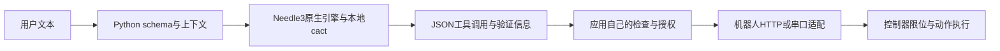

# 配套生态与代码导读

## 一次工具调用经历哪些层

E–G是我们的整合建议，主仓没有纸壳/Tiny专用执行器。只传出合法JSON解决不了任务语义、设备授权、动作可达性和机械安全。

## 主要入口与真实行为

| 文件入口 | 关键职责 | 阅读时要回答的问题 |
|---|---|---|
| [needle/__init__.py](<仓库/cactus-compute__needle/needle/__init__.py>) | Needle类、complete/run/extract/embed、上下文、原生绑定 | 返回建议还是执行函数？是否重置独立请求？ |
| [agent/tools.py](<仓库/cactus-compute__needle/needle/agent/tools.py>) | 装饰器、Python类型和Pydantic转schema | 默认值、required、enum、数值范围如何表达？ |
| [agent/fetch.py](<仓库/cactus-compute__needle/needle/agent/fetch.py>) | 代际、平台、缓存和HF资源获取 | SDK与模型、二进制是不是同代同ABI？ |
| [_worker.py](<仓库/cactus-compute__needle/needle/_worker.py>) | 自定义权重子进程、长度前缀JSON协议 | 独立进程如何加载模型和传播失败？ |
| [agent/whistle.py](<仓库/cactus-compute__needle/needle/agent/whistle.py>) | 音频格式、转录和独立语音权重 | 音频和语言是否符合当前模型要求？ |
| [_telemetry.py](<仓库/cactus-compute__needle/needle/_telemetry.py>) | 默认使用统计与禁用环境变量 | 是否在课堂/离线环境明确关闭？ |
| [model/architecture.py](<仓库/cactus-compute__needle/needle/model/architecture.py>) | JAX/Flax架构与层级深度 | 这是训练参考实现，还是原生部署内核？ |
| [model/export.py](<仓库/cactus-compute__needle/needle/model/export.py>) | cact容器、量化张量与头manifest | 模型实际几层、几bit、哪些输出头？ |
| [environments/_harness.py](<仓库/cactus-compute__needle/needle/environments/_harness.py>) | 工具场景测试、置信度门槛与关键失败 | 通过率之外哪些失败必须阻断？ |
| [pyproject.toml](<仓库/cactus-compute__needle/pyproject.toml>) | SDK3.1.0及运行/训练/麦克风依赖分离 | 推理安装无需同时安装训练栈 |

`needle/agent/__init__.py`不是主类所在位置。默认Needle3通过ctypes绑定动态库，权重与引擎可自动下载；指定自定义本地weights时进入FineTuneWorker。我们的离线测试显式指定本地weights和NEEDLE3_LIB_PATH，禁用了telemetry和Hub网络获取。

## complete、run与拒绝信息

`complete()`返回结构，不能因为tools中声明了函数就认为它已执行。`run()`则在最多8步循环内查找绑定函数并调用 `fn(**arguments)`，把结果回送模型。strict主要处理grounding标记，不能代替我们对设备、会话、频率、动作幅度、期限和权限的检查。SDK该执行循环没有应用层自定义置信度门槛；原生引擎仍可能抑制调用，二者需要分别理解。

实际输出含success、error/error_code、reason、function_calls、suppressed_calls、reasoning、confidence和validation等。离线试验里，无关问题和被抑制动作可能仍有`type=call`，有效调用列表却是空。接入时只允许实际有效调用进入下一层，并按故障字段拒绝；reasoning作为解释和调试线索，不当作执行凭证。

上游[llms参考](<仓库/cactus-compute__needle/llms.txt>)要求system提供环境事实，避免自由指令；触发regex工具可能绕过原生置信度下限，应用仍须独立决定是否执行。extract还可能读取suppressed_calls中的提取候选，因此业务提取与设备执行不可套同一规则。默认保留多轮上下文，并默认加入日期。独立课堂指令应`stateless=True`或显式reset；否则前一个学生或任务的参数可能进入后续上下文。当前C头文件明确说明每种模型使用进程全局、非线程安全状态；多设备/学生并发应隔离进程或严格串行，不能靠多个Python对象就认定互相隔离。

## 自动下载与隐私边界

fetch.py将Needle3引擎版本固定为3.1.0，Needle2为2.0.4；Whistle有独立权重但共用Needle3引擎。`_register_download`会尝试强制获取config.json，即使已有缓存也不等于默认路径完全不尝试联网。离线部署要预装资源并显式指定路径，测试缺权重与断网启动。

Python telemetry代码说明收集计数、版本、系统和随机安装标识，不发送prompt/output；它默认启用，可通过`NEEDLE_TELEMETRY=0`或`DO_NOT_TRACK=1`/CI禁用。本次检查和推理均设置禁用。已下载主仓未含完整Needle3原生内核实现，因此没有声称审计完所有原生遥测路径；课堂部署应在应用层核实网络行为与数据流。

本地LoRA与云端微调是不同路径。训练依赖、完整检查点、校准数据和输出置信度处理不同；cloud平台会上传数据并可能产生费用，本次未调用。不要把公开SDK与模型文件等同于完整可复现的原始训练流程。

## 组织配套：分别评估兼容与借鉴

**Cactus主仓**保存通用C++推理、量化及移动绑定；[旧Needle配置](<仓库/cactus-compute__cactus/python/cactus/models/needle/configuration_needle.py>)仍为12层encoder/8层decoder、512维结构，[test_needle.cpp](<仓库/cactus-compute__cactus/cactus-engine/tests/test_needle.cpp>)使用模型目录与cactus_init/cactus_complete。Needle3为不同容器与needle_load/needle_complete ABI，未证明两条链直接兼容。

**needle-environments**为6个独立工具场景（智能家居、媒体、生产力、可穿戴、厨房、数据采集），保留schema、边界和手工样例。旧README的14MB描述不可覆盖当前35.3MB模型。当前SDK也有环境模块；复用时先比较场景定义和版本。

**cq-convert**实际README是“TurboQuant-H Sanitized Pipeline”，默认Gemma-4-E2B相关，含固定量化预设、校准、导出和mmap工具。说明提到的数据目录未在这次17文件快照中全部提供；动态策略、评估扫描与权重被明确排除。它是量化方法参考，不是Needle3一键转换器。

**depth-over-specialization**实际README标题为Multimodal Encoder。PyTorch模型比较文本/图片/音频的共享与独立编码器，Localized Narratives数据、双向对比损失和检索评估，1U=2层。可参考“共享表示是否优于专门模块”的实验设计，不能称为已完成的机器人多模态感知或Needle3依赖。数据和模型结果未随这次33文件源码快照提供。

移动封装、cactus-hybrid、demo和hackathon等其他组织项目已经在[范围核查](<作者配套核查.json>)中列出；只按元数据/主要入口识别的项目均标记为线索，未冒称完成代码兼容验证。
